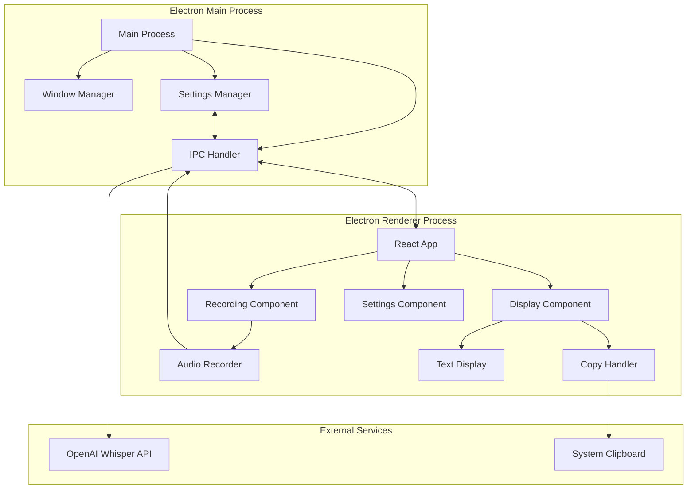
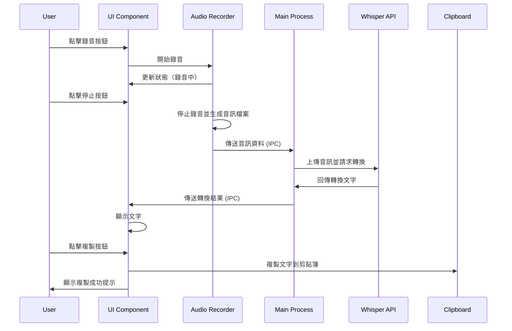

# 設計文件

## 概述

VoiceInputApp 是一個使用 Electron 框架開發的跨平台桌面應用程式，專注於 macOS 平台。應用程式提供一個輕量級的浮動視窗介面，整合 OpenAI Whisper API 進行高品質語音識別，讓使用者可以快速將語音轉換為文字並複製到其他應用程式中使用。

### 技術選型

- **框架**: Electron - 提供跨平台支援和豐富的 API
- **前端**: React + TypeScript - 提供類型安全和組件化開發
- **UI 框架**: Tailwind CSS - 快速建立現代化介面
- **狀態管理**: React Hooks (useState, useContext) - 輕量級狀態管理
- **音訊錄製**: MediaRecorder API - 瀏覽器原生音訊錄製
- **API 客戶端**: OpenAI Node.js SDK - 官方 Whisper API 整合
- **資料儲存**: electron-store - 持久化使用者設定

## 架構

### 系統架構圖



### 應用程式流程



## 組件和介面

### 1. Main Process 組件

#### WindowManager
負責管理應用程式視窗的生命週期和屬性。

```typescript
interface WindowConfig {
  width: number;
  height: number;
  alwaysOnTop: boolean;
  frame: boolean;
  transparent: boolean;
  resizable: boolean;
}

class WindowManager {
  createMainWindow(config: WindowConfig): BrowserWindow;
  setAlwaysOnTop(value: boolean): void;
  setPosition(x: number, y: number): void;
  minimize(): void;
  close(): void;
}
```

#### IPCHandler
處理主程序和渲染程序之間的通訊。

```typescript
interface TranscriptionRequest {
  audioBlob: Buffer;
  language?: string;
}

interface TranscriptionResponse {
  text: string;
  success: boolean;
  error?: string;
}

class IPCHandler {
  handleTranscription(request: TranscriptionRequest): Promise<TranscriptionResponse>;
  handleSaveSettings(settings: AppSettings): Promise<void>;
  handleLoadSettings(): Promise<AppSettings>;
}
```

#### SettingsManager
管理應用程式設定的持久化儲存。

```typescript
interface AppSettings {
  apiKey: string;
  defaultLanguage: 'zh' | 'en';
  shortcuts: {
    startRecording: string;
    stopRecording: string;
  };
  windowOpacity: number;
  historyLimit: number;
}

class SettingsManager {
  save(settings: AppSettings): void;
  load(): AppSettings;
  reset(): void;
}
```

### 2. Renderer Process 組件

#### App Component
應用程式的根組件，管理全域狀態。

```typescript
interface AppState {
  isRecording: boolean;
  isProcessing: boolean;
  transcribedText: string;
  error: string | null;
  history: TranscriptionHistory[];
}

const App: React.FC = () => {
  // 管理全域狀態和提供 context
};
```

#### RecordingControl Component
控制錄音的開始和停止。

```typescript
interface RecordingControlProps {
  onStartRecording: () => void;
  onStopRecording: () => void;
  isRecording: boolean;
  isProcessing: boolean;
}

const RecordingControl: React.FC<RecordingControlProps> = (props) => {
  // 渲染錄音控制按鈕和狀態指示器
};
```

#### TextDisplay Component
顯示轉換後的文字和歷史記錄。

```typescript
interface TextDisplayProps {
  text: string;
  history: TranscriptionHistory[];
  onCopy: (text: string) => void;
  onSelectHistory: (item: TranscriptionHistory) => void;
}

const TextDisplay: React.FC<TextDisplayProps> = (props) => {
  // 渲染文字顯示區域和歷史記錄列表
};
```

#### Settings Component
提供設定介面。

```typescript
interface SettingsProps {
  settings: AppSettings;
  onSave: (settings: AppSettings) => void;
  onClose: () => void;
}

const Settings: React.FC<SettingsProps> = (props) => {
  // 渲染設定表單
};
```

#### AudioRecorder Service
封裝音訊錄製邏輯。

```typescript
class AudioRecorder {
  private mediaRecorder: MediaRecorder | null;
  private audioChunks: Blob[];
  
  async startRecording(): Promise<void>;
  stopRecording(): Promise<Blob>;
  isRecording(): boolean;
  getAudioBlob(): Blob;
}
```

### 3. API 整合

#### WhisperClient
封裝 OpenAI Whisper API 的呼叫。

```typescript
interface WhisperClientConfig {
  apiKey: string;
  model?: string;
}

interface TranscriptionOptions {
  language?: string;
  prompt?: string;
}

class WhisperClient {
  constructor(config: WhisperClientConfig);
  
  async transcribe(
    audioFile: Buffer,
    options?: TranscriptionOptions
  ): Promise<string>;
  
  validateApiKey(): Promise<boolean>;
}
```

## 資料模型

### TranscriptionHistory
儲存歷史轉換記錄。

```typescript
interface TranscriptionHistory {
  id: string;
  text: string;
  timestamp: number;
  language: string;
  duration: number; // 錄音時長（秒）
}
```

### AppSettings
應用程式設定資料結構（已在上方定義）。

## 錯誤處理

### 錯誤類型

```typescript
enum ErrorType {
  MICROPHONE_ACCESS_DENIED = 'MICROPHONE_ACCESS_DENIED',
  API_KEY_INVALID = 'API_KEY_INVALID',
  API_REQUEST_FAILED = 'API_REQUEST_FAILED',
  NETWORK_ERROR = 'NETWORK_ERROR',
  AUDIO_RECORDING_FAILED = 'AUDIO_RECORDING_FAILED',
  UNKNOWN_ERROR = 'UNKNOWN_ERROR'
}

interface AppError {
  type: ErrorType;
  message: string;
  details?: any;
}
```

### 錯誤處理策略

1. **麥克風權限錯誤**: 顯示明確的提示訊息，引導使用者到系統設定中授予權限
2. **API 金鑰錯誤**: 提示使用者檢查 API 金鑰並提供設定連結
3. **網路錯誤**: 顯示重試按鈕，允許使用者重新嘗試
4. **錄音失敗**: 記錄錯誤日誌，提示使用者重新開始錄音
5. **未知錯誤**: 顯示通用錯誤訊息並記錄詳細資訊供除錯

### 錯誤顯示

```typescript
const ErrorDisplay: React.FC<{ error: AppError }> = ({ error }) => {
  // 根據錯誤類型顯示適當的訊息和操作按鈕
};
```

## UI/UX 設計

### 視窗設計

- **尺寸**: 預設 400x600 像素，可調整大小
- **位置**: 記住上次關閉時的位置
- **透明度**: 可調整（80-100%）
- **邊框**: 自訂邊框，包含拖曳區域和最小化/關閉按鈕

### 主介面佈局

```
┌─────────────────────────────────┐
│  ⋮⋮  VoiceInput    [─] [×]     │ <- 標題列（可拖曳）
├─────────────────────────────────┤
│                                 │
│     [●] 開始錄音                │ <- 錄音控制
│                                 │
│  ┌───────────────────────────┐ │
│  │                           │ │
│  │  轉換後的文字顯示在這裡    │ │ <- 文字顯示區
│  │                           │ │
│  │                           │ │
│  └───────────────────────────┘ │
│                                 │
│     [📋 複製]  [⚙️ 設定]       │ <- 操作按鈕
│                                 │
│  ┌───────────────────────────┐ │
│  │ 歷史記錄                  │ │
│  │ • 記錄 1                  │ │ <- 歷史記錄列表
│  │ • 記錄 2                  │ │
│  └───────────────────────────┘ │
│                                 │
│  狀態: 就緒                     │ <- 狀態列
└─────────────────────────────────┘
```

### 狀態指示

- **就緒**: 灰色圓點
- **錄音中**: 紅色脈動圓點 + 計時器
- **處理中**: 藍色旋轉動畫
- **完成**: 綠色勾選圖示（2秒後消失）
- **錯誤**: 紅色驚嘆號 + 錯誤訊息

### 互動設計

1. **錄音按鈕**: 
   - 未錄音: 顯示麥克風圖示
   - 錄音中: 變為停止圖示，背景變紅
   - 處理中: 禁用狀態，顯示載入動畫

2. **複製按鈕**:
   - 點擊後顯示「已複製」提示
   - 2秒後恢復原狀

3. **歷史記錄**:
   - 點擊項目可重新載入該文字
   - 滑鼠懸停顯示完整時間戳記

## 測試策略

### 單元測試

- **AudioRecorder**: 測試錄音開始、停止、音訊資料生成
- **WhisperClient**: 測試 API 呼叫、錯誤處理、金鑰驗證
- **SettingsManager**: 測試設定的儲存、載入、重置

### 整合測試

- **IPC 通訊**: 測試主程序和渲染程序之間的資料傳輸
- **完整流程**: 測試從錄音到顯示結果的完整流程
- **錯誤恢復**: 測試各種錯誤情況下的應用程式行為

### 手動測試

- **UI 互動**: 測試所有按鈕和控制項的回應
- **視窗行為**: 測試拖曳、調整大小、置頂功能
- **音訊品質**: 測試不同環境下的錄音品質
- **API 整合**: 測試實際的 Whisper API 呼叫和結果

### 效能測試

- **記憶體使用**: 監控長時間運行的記憶體佔用
- **CPU 使用**: 測試錄音和處理時的 CPU 負載
- **回應時間**: 測量從停止錄音到顯示結果的時間

## 安全性考量

1. **API 金鑰儲存**: 使用 electron-store 的加密功能儲存 API 金鑰
2. **音訊資料**: 錄音資料僅在記憶體中處理，傳送後立即清除
3. **網路請求**: 僅與 OpenAI API 通訊，使用 HTTPS
4. **權限管理**: 明確請求麥克風權限，並處理拒絕情況

## 效能優化

1. **音訊壓縮**: 使用適當的音訊格式（如 MP3）減少檔案大小
2. **懶載入**: 歷史記錄採用虛擬滾動，僅渲染可見項目
3. **防抖動**: 設定變更使用防抖動，避免頻繁儲存
4. **記憶體管理**: 限制歷史記錄數量，自動清理舊記錄

## 部署和打包

### 建置配置

```json
{
  "build": {
    "appId": "com.voiceinput.app",
    "productName": "VoiceInput",
    "mac": {
      "category": "public.app-category.productivity",
      "target": ["dmg", "zip"],
      "icon": "build/icon.icns"
    },
    "files": [
      "dist/**/*",
      "node_modules/**/*",
      "package.json"
    ]
  }
}
```

### 發布流程

1. 執行測試套件確保品質
2. 更新版本號碼
3. 建置生產版本
4. 產生 DMG 安裝檔
5. 測試安裝檔在乾淨的 macOS 環境中
6. 發布到 GitHub Releases

## 未來擴展

1. **多語言支援**: 支援更多語言的語音識別
2. **自訂模型**: 允許使用者選擇不同的 Whisper 模型
3. **快捷指令整合**: 與 macOS 快捷指令整合
4. **雲端同步**: 同步歷史記錄到雲端
5. **即時轉換**: 在錄音時即時顯示轉換結果
