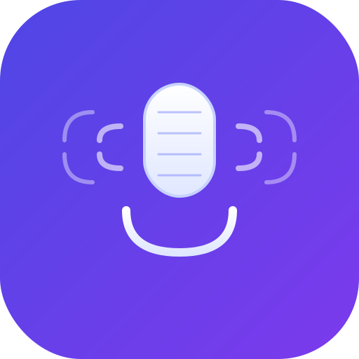

# VoiceInput

<div align="center">



**A lightweight macOS floating window app for voice-to-text conversion**

[](LICENSE)
[](https://www.electronjs.org/)
[](https://reactjs.org/)
[](https://www.typescriptlang.org/)

</div>

## ✨ Features

- 🎙️ **High-Quality Voice Recognition** - Powered by OpenAI Whisper API
- 🪟 **Always-On-Top Floating Window** - Stay accessible while you work
- 🌏 **Multi-Language Support** - Chinese and English recognition
- 📋 **Quick Copy** - One-click copy to clipboard
- 📜 **Transcription History** - Access your recent transcriptions
- ⚙️ **Customizable Settings** - Adjust opacity, shortcuts, and preferences
- 🎨 **Modern UI** - Clean, intuitive interface with Tailwind CSS
- ⚡ **Lightweight** - Minimal memory footprint (< 100MB idle)

## 📸 Screenshots

<!-- Add screenshots here when available -->

## 🚀 Quick Start

### Prerequisites

- macOS 10.15 (Catalina) or later
- OpenAI API key ([Get one here](https://platform.openai.com/api-keys))

### Installation

#### Option 1: Download Release (Recommended)

1. Download the latest `VoiceInput-x.x.x.dmg` from [Releases](../../releases)
2. Open the DMG file
3. Drag VoiceInput to your Applications folder
4. Launch VoiceInput from Applications

#### Option 2: Build from Source

See [Development](#-development) section below.

### First-Time Setup

1. **Launch the app** - VoiceInput will appear as a floating window
2. **Open Settings** - Click the ⚙️ settings icon
3. **Enter API Key** - Paste your OpenAI API key
4. **Grant Microphone Permission** - Allow access when prompted
5. **Start Recording** - Click the microphone button or use the keyboard shortcut

## 📖 Usage Guide

### Recording Audio

1. **Start Recording**
   - Click the microphone button
   - Or press `Cmd+Shift+R` (customizable)
   - The button will turn red and pulse while recording

2. **Stop Recording**
   - Click the stop button
   - Or press `Cmd+Shift+S` (customizable)
   - The app will process your audio automatically

3. **View Results**
   - Transcribed text appears in the display area
   - Click the copy button to copy to clipboard
   - Text is automatically saved to history

### Managing History

- **View History** - Scroll through recent transcriptions below the main display
- **Reload Text** - Click any history item to load it back into the display
- **Clear History** - Click the "清空" (Clear) button to remove all history

### Customizing Settings

Open settings (⚙️ icon) to configure:

- **API Key** - Your OpenAI API key (stored securely)
- **Default Language** - Choose between Chinese (中文) or English
- **Window Opacity** - Adjust transparency (50-100%)
- **Keyboard Shortcuts** - Customize recording shortcuts
- **History Limit** - Set maximum number of saved transcriptions (1-100)

### Keyboard Shortcuts

| Action | Default Shortcut | Customizable |
|--------|-----------------|--------------|
| Start Recording | `Cmd+Shift+R` | ✅ |
| Stop Recording | `Cmd+Shift+S` | ✅ |

## 🛠️ Development

### Prerequisites

- Node.js 18+ ([Download](https://nodejs.org/))
- npm (comes with Node.js)
- macOS for development and testing

### Setup

1. **Clone the repository**
```bash
git clone https://github.com/YOUR_USERNAME/voice-input-assistant.git
cd voice-input-assistant
```

2. **Install dependencies**
```bash
npm install
```

3. **Set up environment** (optional)
```bash
# Create .env file for development
echo "OPENAI_API_KEY=your-api-key-here" > .env
```

4. **Run in development mode**
```bash
npm run dev
```

This will:
- Start the Vite dev server for the renderer process
- Compile and run the Electron main process
- Open the application with hot-reload enabled

### Building

#### Build for Development
```bash
npm run build
```

#### Package for Distribution
```bash
# Create DMG and ZIP for macOS
npm run package:mac

# Create unpacked app for testing
npm run package:mac:dir
```

See [PACKAGING.md](PACKAGING.md) for detailed packaging instructions.

### Project Structure

```
voice-input-assistant/
├── src/
│   ├── main/              # Electron main process
│   │   ├── main.ts        # Entry point
│   │   ├── WindowManager.ts
│   │   ├── IPCHandler.ts
│   │   ├── WhisperClient.ts
│   │   ├── AudioProcessor.ts
│   │   ├── SettingsManager.ts
│   │   └── HistoryManager.ts
│   ├── renderer/          # React frontend
│   │   ├── App.tsx        # Main component
│   │   ├── components/    # UI components
│   │   └── services/      # Frontend services
│   └── shared/            # Shared code
│       ├── types.ts       # TypeScript types
│       ├── constants.ts   # Constants
│       └── errorHandler.ts
├── build/                 # Build assets
│   └── icon.svg          # App icon
├── scripts/              # Build scripts
└── dist/                 # Compiled output
```

### Tech Stack

- **Framework**: Electron 28
- **Frontend**: React 18 + TypeScript
- **Styling**: Tailwind CSS
- **Build Tool**: Vite
- **API Client**: OpenAI Node.js SDK
- **Storage**: electron-store

## 🔑 Getting an OpenAI API Key

1. Go to [OpenAI Platform](https://platform.openai.com/)
2. Sign up or log in to your account
3. Navigate to [API Keys](https://platform.openai.com/api-keys)
4. Click "Create new secret key"
5. Copy the key (it starts with `sk-`)
6. Paste it into VoiceInput settings

**Note**: Keep your API key secure and never share it publicly.

### API Costs

OpenAI Whisper API pricing (as of 2024):
- $0.006 per minute of audio
- Example: 10 minutes of transcription = $0.06

See [OpenAI Pricing](https://openai.com/pricing) for current rates.

## ⚙️ Configuration

### Settings File Location

Settings are stored in:
```
~/Library/Application Support/voice-input-app/config.json
```

### Default Settings

```json
{
  "apiKey": "",
  "defaultLanguage": "zh",
  "shortcuts": {
    "startRecording": "CommandOrControl+Shift+R",
    "stopRecording": "CommandOrControl+Shift+S"
  },
  "windowOpacity": 0.95,
  "historyLimit": 50
}
```

## 🐛 Troubleshooting

### Microphone Permission Denied

**Problem**: App can't access microphone

**Solution**:
1. Open System Preferences > Security & Privacy > Privacy
2. Select "Microphone" from the left sidebar
3. Check the box next to VoiceInput
4. Restart the app

### API Key Invalid

**Problem**: "Invalid API key" error

**Solution**:
1. Verify your API key starts with `sk-`
2. Check for extra spaces or characters
3. Generate a new key from OpenAI Platform
4. Ensure your OpenAI account has credits

### App Won't Open

**Problem**: "App is damaged and can't be opened"

**Solution** (for unsigned builds):
```bash
xattr -cr /Applications/VoiceInput.app
```

### High Memory Usage

**Problem**: App using too much memory

**Solution**:
1. Clear transcription history
2. Reduce history limit in settings
3. Restart the app
4. Check for memory leaks (report if persistent)

### Audio Not Recording

**Problem**: Recording starts but no audio captured

**Solution**:
1. Check microphone is working in other apps
2. Grant microphone permissions
3. Try a different microphone (if available)
4. Check system audio settings

## 🤝 Contributing

Contributions are welcome! Please feel free to submit a Pull Request.

### Development Guidelines

1. Follow TypeScript best practices
2. Use ESLint and Prettier for code formatting
3. Write meaningful commit messages
4. Test thoroughly before submitting PR
5. Update documentation as needed

## 📄 License

This project is licensed under the MIT License - see the [LICENSE](LICENSE) file for details.

## 🙏 Acknowledgments

- [OpenAI](https://openai.com/) for the Whisper API
- [Electron](https://www.electronjs.org/) for the framework
- [React](https://reactjs.org/) for the UI library
- [Tailwind CSS](https://tailwindcss.com/) for styling

## 📞 Support

- 🐛 [Report a Bug](../../issues/new?labels=bug)
- 💡 [Request a Feature](../../issues/new?labels=enhancement)
- 📖 [Documentation](../../wiki)

## 🗺️ Roadmap

- [ ] Support for more languages
- [ ] Real-time transcription
- [ ] Custom Whisper model selection
- [ ] Cloud sync for history
- [ ] macOS Shortcuts integration
- [ ] Batch file transcription

---

<div align="center">

Made with ❤️ for developers who prefer speaking to typing

</div>
